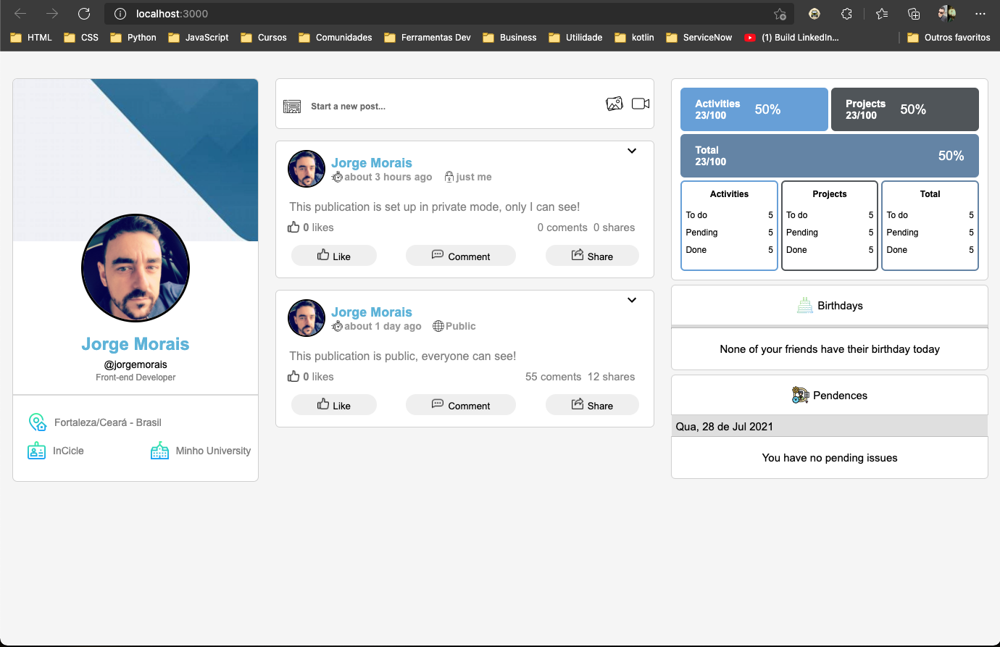

<h1 align="center">
  Screen of a Social Midia Network
    <br>
</h1>
<h3 align="center">
  Desktop screen
    <br>
</h3>

<h3 align="center">
  Mobile
    <br>
</h3>
<div align="center">

</div>

<h4 align="center">
The app consists of a screen of a corporate social network, developed with react, using flexbox and useState
</h4>
<br>

<p align="center">


</p>

<p align="center">
  <a href="built-with">Built with</a>&nbsp;&nbsp;&nbsp;|&nbsp;&nbsp;&nbsp;
  <a href="#information_source-how-to-run">How to run</a>
</p>
<br><br>

## Built with

This project was developed with the following technologies:

- [React](https://reactjs.org/)
- [Css3](https://www.w3schools.com/Css/css_intro.asp)
- [JavaScript](https://www.javascript.com/)
- [VS Code](https://code.visualstudio.com/)

## information_source: How to run

### Requirements

To run the app, you will need [Git](https://git-scm.com), [Node.js](https://nodejs.org/) v12.13.1 or higher, [Npm](https://www.npmjs.com/).
<br>
<br>

### Application

Now clone the repository and install the dependencies.

```bash
# to clone the repository
git clone git@github.com:Mopanc/profile-page.git

# go into the folder
cd profile-page/

#install the backend dependencies
npm install

#I used that dependencies to
npm install react-router-dom
npm install styled-components


```

# run application

After installing the dependencies, you can go to your terminal, enter the project folder, called "profile-page" and run the command
<br>

```bash
 npm start
```

by [Jorge Morais](https://github.com/Mopanc) and JS :yellow_heart:

## More info

# Getting Started with Create React App

This project was bootstrapped with [Create React App](https://github.com/facebook/create-react-app).

## Available Scripts

In the project directory, you can run:

### `yarn start`

Runs the app in the development mode.\
Open [http://localhost:3000](http://localhost:3000) to view it in the browser.

The page will reload if you make edits.\
You will also see any lint errors in the console.

### `yarn test`

Launches the test runner in the interactive watch mode.\
See the section about [running tests](https://facebook.github.io/create-react-app/docs/running-tests) for more information.

### `yarn build`

Builds the app for production to the `build` folder.\
It correctly bundles React in production mode and optimizes the build for the best performance.

The build is minified and the filenames include the hashes.\
Your app is ready to be deployed!

See the section about [deployment](https://facebook.github.io/create-react-app/docs/deployment) for more information.

### `yarn eject`

**Note: this is a one-way operation. Once you `eject`, you can’t go back!**

If you aren’t satisfied with the build tool and configuration choices, you can `eject` at any time. This command will remove the single build dependency from your project.

Instead, it will copy all the configuration files and the transitive dependencies (webpack, Babel, ESLint, etc) right into your project so you have full control over them. All of the commands except `eject` will still work, but they will point to the copied scripts so you can tweak them. At this point you’re on your own.

You don’t have to ever use `eject`. The curated feature set is suitable for small and middle deployments, and you shouldn’t feel obligated to use this feature. However we understand that this tool wouldn’t be useful if you couldn’t customize it when you are ready for it.

## Learn More

You can learn more in the [Create React App documentation](https://facebook.github.io/create-react-app/docs/getting-started).

To learn React, check out the [React documentation](https://reactjs.org/).

### Code Splitting

This section has moved here: [https://facebook.github.io/create-react-app/docs/code-splitting](https://facebook.github.io/create-react-app/docs/code-splitting)

### Analyzing the Bundle Size

This section has moved here: [https://facebook.github.io/create-react-app/docs/analyzing-the-bundle-size](https://facebook.github.io/create-react-app/docs/analyzing-the-bundle-size)

### Making a Progressive Web App

This section has moved here: [https://facebook.github.io/create-react-app/docs/making-a-progressive-web-app](https://facebook.github.io/create-react-app/docs/making-a-progressive-web-app)

### Advanced Configuration

This section has moved here: [https://facebook.github.io/create-react-app/docs/advanced-configuration](https://facebook.github.io/create-react-app/docs/advanced-configuration)

### Deployment

This section has moved here: [https://facebook.github.io/create-react-app/docs/deployment](https://facebook.github.io/create-react-app/docs/deployment)

### `yarn build` fails to minify

This section has moved here: [https://facebook.github.io/create-react-app/docs/troubleshooting#npm-run-build-fails-to-minify](https://facebook.github.io/create-react-app/docs/troubleshooting#npm-run-build-fails-to-minify)
